# Health Trail by Kamsiob

[](https://github.com/Kamsiob/health-trail/actions/workflows/ci.yml)
[](LICENSE)
[](templates/LICENSE-CONTENT.md)
[](https://github.com/Kamsiob/health-trail/issues/1)

**A private care notebook for family caregivers. Everything stays on your phone.**

> **Not installable yet.** This is being built in the open. There is no release, no APK, and no store listing. Phase 0, the foundation and the data contract, is substantially built. Phase 1, the screens people actually use, is where the work is. The [board](https://github.com/users/Kamsiob/projects/2) has the detail and `HANDOFF.md` is the current state in full.

---

## What this is, and who it is for

When someone in a family needs ongoing care, one person ends up holding the whole picture. They make the phone calls, sit in the meetings, chase the paperwork, and remember what the night nurse said three weeks ago. Providers rarely talk to each other, so in practice that person becomes the information hub whether they wanted to be or not.

Health Trail is that hub, given structure. One trail of every call, visit, incident, medication change, document, and dollar, kept for years, searchable in seconds, and never leaving the phone.

It is for the son, daughter, spouse, or parent doing that work. It is not for the patient, and it is not for clinicians.

It is a record-keeping app. It is not a medical app, and it gives no medical advice.

## What it looks like

Real captures from the running app on a Pixel 10 Pro XL. **Nothing here is a mockup or a rendering of a design file**, and the capture script refuses to run unless this app is the focused window.

| | | |
|---|---|---|
| 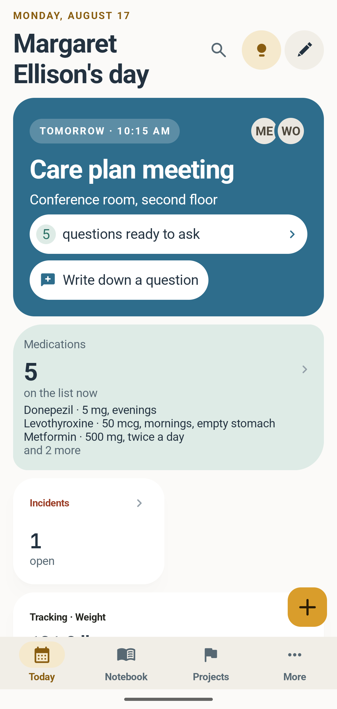 | 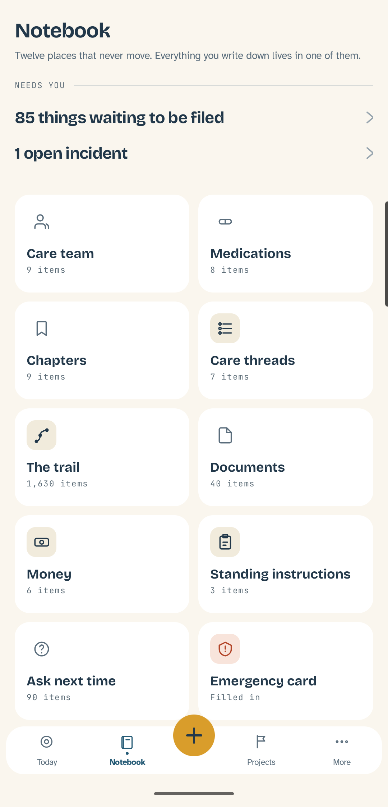 | 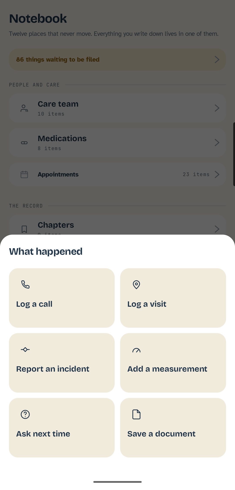 |
| **Today**, on a notebook with nothing in it. It coaches rather than sitting blank, and the emergency card is always the first suggestion. | **The notebook.** Twelve sections that never move, so nothing is ever somewhere new. | **Capture.** One gold button on every screen, six ways in. |
| 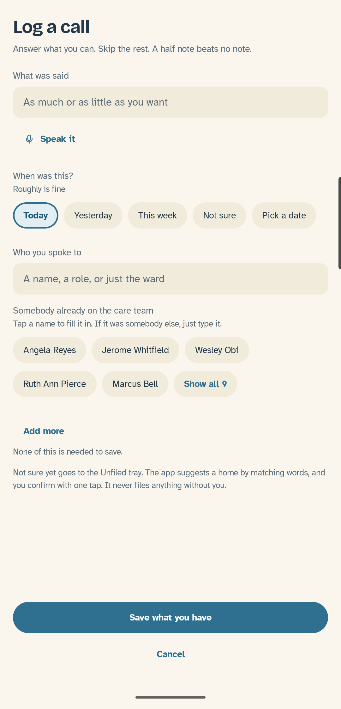 | 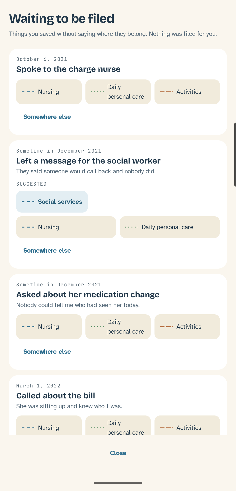 | 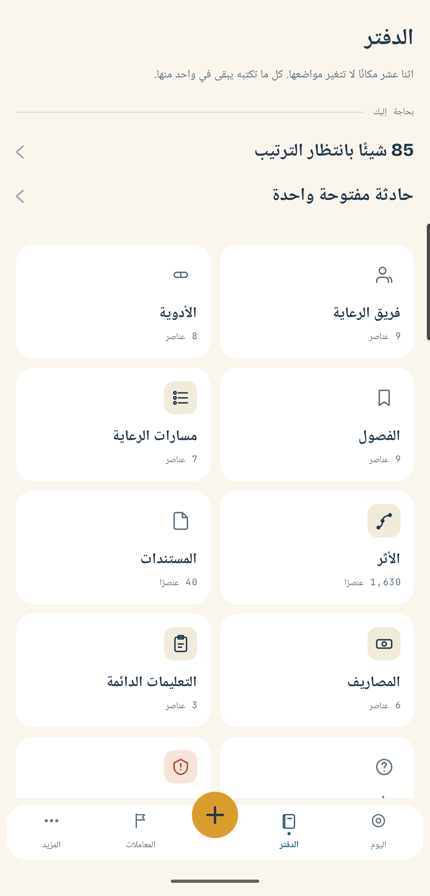 |
| 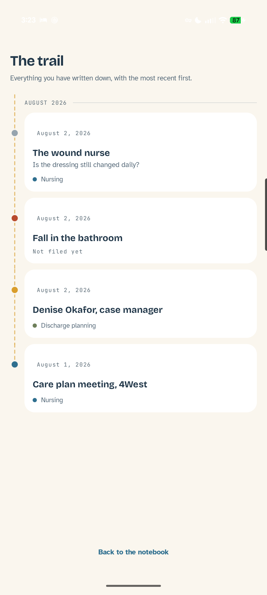 | 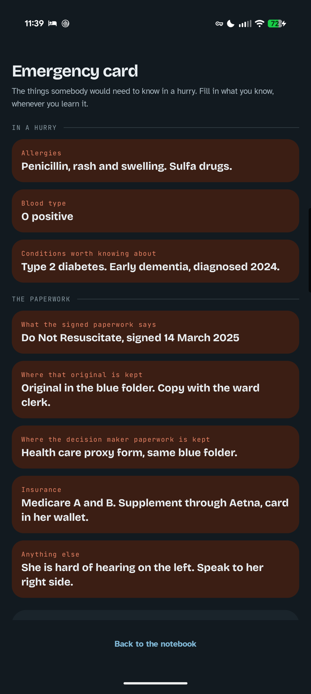 | 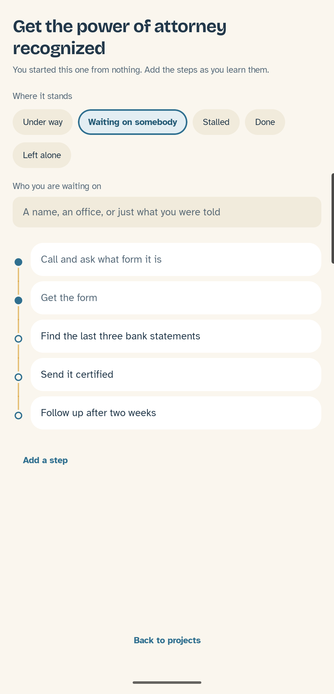 |
| **The trail.** Everything written down, on the app's own dashed route. Ordered by when things happened, not when they were typed. | **The emergency card**, designed to be handed to a paramedic. What the signed paperwork says is quoted, never interpreted. | **Projects.** Sixteen long processes with their ordered steps, all of them yours to change, so nobody learns a Medicaid application one missed requirement at a time. |
| 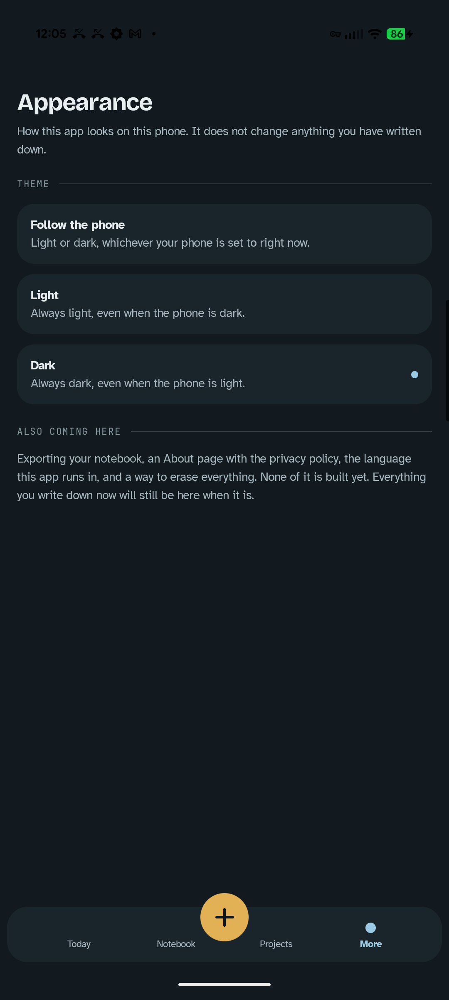 | 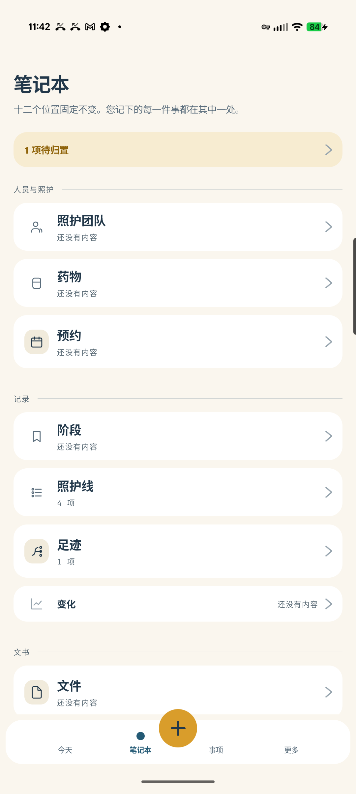 | 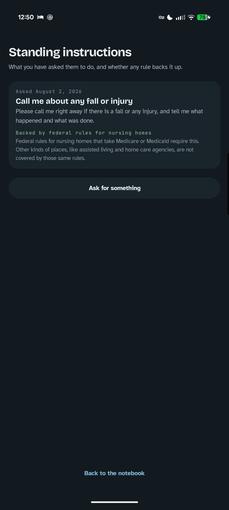 |
| **A call, logged.** Every field optional. "Roughly is fine" for the date, and the button says **Save what you have**. | **Nothing gets filed for you.** Anything saved without a home waits here, with a suggestion you confirm. | **Arabic, on the device.** Mirrored right to left, real glyphs. Right to left was built in from the first screen rather than added at the end. |
| **Dark, on a phone set to light.** The theme is the app's own setting, not an inherited one. | **Chinese**, in the system CJK face. Nothing is bundled for it, because Android already ships a good one. | **What backs a request up.** Every standing instruction says whether a federal rule requires it or whether it is something nobody has to agree to. |

`reference/screen-grid.html` holds the 27 approved screens as the binding visual reference, and `DESIGN.md` holds the tokens, type scale, motion, and copy rules the built app is held to.

Every color pair in both themes is measured against the WCAG AA floors by `check_contrast.py` on every push.

## What it can do today

**This section describes the built app, not the plan.** Everything listed here runs on a real device and has a test holding it there. What is still ahead is in the section after it.

- **Capture that forgives, all six ways in.** A call, a visit, an incident, a measurement, a question for next time, and a document. **Every field is optional** and the button says "Save what you have". Rough dates are first-class: today, yesterday, this week, not sure, or a picked date.
- **Dates that do not lie about their own precision.** Built on EDTF, the extended date format from ISO 8601-2. "August 2026" stays August 2026 and never quietly becomes August 1st. Unknown is a real value rather than a blank, and uncertainty is recorded separately from precision.
- **All twelve notebook sections open onto real screens**, and all six ways in are built. Care team, medications, appointments, chapters, care threads, the trail, progress, documents, money, standing instructions, ask next time, and the emergency card. Anything saved can be corrected by tapping it or removed by holding it.
- **Projects: the long processes**, from a catalog of sixteen. A Medicaid application, an appeal against a discharge, a records request. Each arrives with its ordered steps, because otherwise somebody learns the process one missed requirement at a time.
- **Standing instructions that say what backs them up.** Every one carries a tag saying whether federal nursing home rules require it or whether it is a request nobody has to agree to, with the scope of those rules stated plainly.
- **An emergency card designed to be handed to a paramedic.** Who to call, what they take, allergies and conditions, and what the signed paperwork says, quoted rather than interpreted.
- **The trail, which is the record you can actually read back.** Everything written down, on a dashed route with a node per entry colored by what it was, headed by month. Ordered by **when things happened rather than when they were typed**, so a call logged Tuesday about Sunday sits on Sunday. Entries whose date is not known gather at the end under their own heading rather than being quietly placed at today.
- **Every date is editable forever, from the entry itself.** Tap the date on any entry in the trail and the same picker every other date uses opens on it. A date written down in a hallway is the one most likely to be wrong.
- **Nothing gets filed for you.** Anything saved without a home lands in an Unfiled tray, where the app reads the words you wrote, suggests a care thread, and waits for you to confirm. It never files on its own.
- **A notebook with twelve sections that never move**, grouped and folded to the kind of care being given. A hospital stay brings appointments and the trail forward and folds money away; a different situation folds differently.
- **Setup you can skip entirely.** Three questions, all optional. Skipping produces a working notebook. Answering "not sure yet" is a real answer that changes what the app asks you later.
- **Four locales with right to left working**, English, Spanish, Chinese, and Arabic, verified by running the app in Arabic on a device rather than by reading the code.
- **Light or dark, your choice.** Follow the phone, or pin the app to one regardless of what the phone is doing. It applies the moment you pick it.
- **A summary of what changed since you were last here.** Today leads with it, in one line, and says so plainly when nothing has changed rather than leaving you to work that out from an empty screen.
- **Universal search** across every section at once, from the top of Today.
- **An export that opens somewhere other than the phone that wrote it**, encrypted with a passphrase you choose, with a restore that shows you what is in the file before anything changes.
- **Documents as a gallery of your own paper**, three across and grouped by year, with where each original physically is written under it. The photograph is rarely the copy a clerk will accept.
- **Projects you own rather than checklists you were handed.** Every step can be added, renamed, reordered, annotated or removed, a project can be started with no template at all, and a project's steps can be saved as your own template. Editing one of the sixteen the app ships with makes your copy rather than changing the catalog, so an update can never overwrite what you wrote.
- **A standing instruction that records the times it was not followed**, which is the difference between "we asked in March" and "we asked in writing in March, and it happened again in May and again in June".
- **Encrypted at rest**, SQLCipher with the key in the Android Keystore, proven by reading the file back and asserting it is not a plain SQLite database.
- **A record that can survive sync it does not have yet.** Every row carries a locally generated id, timestamps, a revision, an origin device, and a tombstone column. **Deletion is always a tombstone, never a removed row**, and every write appends to a change log in the same transaction, enforced by database triggers rather than by application code remembering to.

## What is still being built

The honest list. This section shrinks as things land.

- **Scoped search**, inside every section, and the assembled view of everything connected to one thing. Universal search across every section is built and works from Today.
- **Everything connects, both ways.** Most of it does now. Three connections need columns the schema does not have yet: an incident knowing its project, a bill knowing the call where it was disputed, and a bill knowing the standing instruction it broke.
- **Capture from outside the app**, as a widget, a quick settings tile, and a share sheet target.
- **Automatic local backup** to a folder you choose, with no cloud involved.
- **Language access for caregivers in the United States** who do not read English well. Ten languages chosen by limited English proficiency population. **This is language access, not international expansion:** the federal, Medicare, and Medicaid content is specific to this country, so translating for a Spanish speaker in Texas is right and presenting the same app to someone in Spain would be wrong.

## What it cannot do, and will not

These are decisions rather than gaps. [ROADMAP.md](ROADMAP.md) carries the reasoning for each, along with what is planned and what is only under consideration.

- **No cloud, no server, no account.** There is nothing to sign in to. Sharing means exporting a document and sending it yourself, which also means there is no live shared view for several family members.
- **No medical or legal advice, and no educational content.** The app records, organizes, and counts. It never concludes.
- **No target ranges, normal values, thresholds, or color coding by value.** No arrows, no judgments on any measurement. Where a field records a clinical assessment, it records what a clinician said and the label says so.
- **No reminders, alerts, or medication dose tracking.** It keeps the record. It does not nag, and the medications screen says that plainly rather than burying it.
- **No streaks, badges, or engagement notifications.** Stopping for months is normal. When you come back, it tells you what changed since you were last here, with nothing that implies the gap was a failure.
- **No ads, no subscription, no paywall, no in-app purchase.**
- **No analytics, no telemetry, no crash reporting.** No network calls at all.
- **No model, no inference, no AI in the app.** Every digest and count is deterministic, composed from your own entries, and every line taps through to the entry it came from.

## Install

There is no release yet. When there is, it will be on Google Play and as a GitHub release asset. Both carry the same signature, so you can install from either and switch between them without losing anything.

## Build from source

You need JDK 21, the Android SDK, and Python 3.

```
git clone https://github.com/Kamsiob/health-trail.git
cd health-trail/android
./gradlew assembleDebug
```

The build reads `contract/schema.sql` and `templates/data/*.json` and copies them into the app's assets. It fails loudly rather than falling back to a stale internal copy, so if it cannot find them you are running Gradle from the wrong directory.

`CONTRIBUTING.md` has the full setup, the conventions, and how to run the tests.

## How this repository is laid out

```
contract/     the schema, the export format, the message catalogs, and the golden
              test vectors. Platform neutral. Both the app and the web scaffold
              read from here, and neither keeps its own copy.
templates/    57 care templates as JSON, published separately under CC BY-SA 4.0
              so they are useful to people who never install anything.
android/      the Kotlin application.
web/          a scaffold whose only job is to open the same schema, which is what
              stops the two platforms drifting. It has no features.
tools/        the fixture generator, the compliance checks, and the build scripts.
reference/    the 27 approved screens.
docs/         the roadmap's supporting notes, the bundled font licenses, and the
              device screenshots, which are real captures and never mockups.
```

[ROADMAP.md](ROADMAP.md) is what is planned, what is being worked on now, and what this app will deliberately never do.

## Approach and methodology

The app is specified before it is built, and the specification is kept current with the code rather than written once. `MASTER_SPEC.md` is what the app is, `DESIGN.md` is binding on every visual and copy decision, and `contract/DATA-CONTRACT.md` governs the data model and cannot be changed without an explicit decision, because changing a schema after real data exists means discarding someone's records.

Decisions are recorded in `DECISIONS.md` as they are made, with the alternatives considered and the reasoning, so the same question does not get reopened later. The issue tracker and the board are the authoritative record of what is done, what is in progress, and what is blocked. Work is verified on real hardware before it is marked complete, and an issue is closed only after the behavior was looked at on a connected phone, never because code was written. There is no emulator on this project and its absence is deliberate: a long lived installation on one device is a sample of one that nobody can reproduce, so data survival is proven by the export and import round trip against shared test vectors in continuous integration instead. `HANDOFF.md` is kept current to within one increment so the project can be picked up cold.

### How this is built

The implementation is written by Claude Code, a coding agent, working from the specification documents in this repository, directed by one person who does not write code.

That person's half is the part the agent cannot do: deciding what the app is and who it is for, writing and owning the specifications, resolving what happens when two of them conflict, judging whether the built thing is actually usable by an exhausted person in a hospital corridor, and testing it against a real situation rather than a test case.

Directing long autonomous runs turned out to require a specific set of guards, each answering a failure that happens rather than one that might. A run can destroy hours of work with a single command, so destructive commands are meant to be refused by a hook rather than avoided by intention. Context gets compacted on a long run, after which the session can revert to an earlier understanding and redo work it already finished, so state is committed before compaction and the repository is treated as the truth afterward rather than memory. An agent that hits the same error repeatedly will fix the same wrong thing twenty times and report success each round, so attempts are capped at three and then escalated in writing. A delegated task that needs a permission cannot ask for one, and silently reports success for a change that never reached disk, so the agents that assist are scoped to read only and cannot write anything. Work is claimed complete only against the working tree, never against recollection.

**The most useful thing this project has learned about those guards is that all three of them were broken, and that the repository said otherwise for a week.** The hook command interpolated a path, the path contains spaces, the shell split it, the executable was never found, and the hook exited 127. A blocking hook has to exit 2, so 127 read as "nothing to say" and every destructive command ran. The pre-compaction save had the identical defect. The retry cap turned out not to be a hook at all but a tool nothing ever called.

None of that produced a single line of output, which is the whole point: **a guard that does not fire looks exactly like a guard with nothing to do.** It surfaced only when a command that should have been refused reached a real phone. The first diagnosis was wrong too, and confidently so, which cost another week.

What changed is not the guards, which were a one line fix. It is that a guard is now considered unproven until a command that must be refused has actually been refused, that check runs at the start of every session rather than once, and a check in continuous integration fails the build if the quoting regresses. `DECISIONS.md` D29 and D49 have the full account, including the wrong diagnosis, kept rather than tidied away.

What came out of it is a repository where the specification, the reasoning, and the state are all readable by someone arriving with no context, and where the app's promises about medical advice, interpretation, and data leaving the device are checked by tests on every push rather than upheld by good intentions.

Specialized agents handle review, testing, and verification, and their definitions are in `.claude/agents/`. They can read, run, and report. They cannot write.

## License

Code is [AGPL-3.0](LICENSE).

Template content in `templates/` is [CC BY-SA 4.0](templates/LICENSE-CONTENT.md), published separately so it is useful with a paper binder, a spreadsheet, or a notes app, by people who never install anything.

## Support this work

Built and carried by one person. If software made this way matters to you, there is a place to stand behind it. Either way, it is yours.

[Support this work](https://buymeacoffee.com/kamsiob)

## Elsewhere

- Website: https://kamsiob.com
- GitHub: https://github.com/kamsiob
- YouTube: https://youtube.com/@kamsiob
- Telegram, the Kamsiob Lab group: https://t.me/+g5LKm9rUnNcxMjk5
- Feedback: hello@kamsiob.com. One person builds this, everything gets read, and not everything gets a reply.
